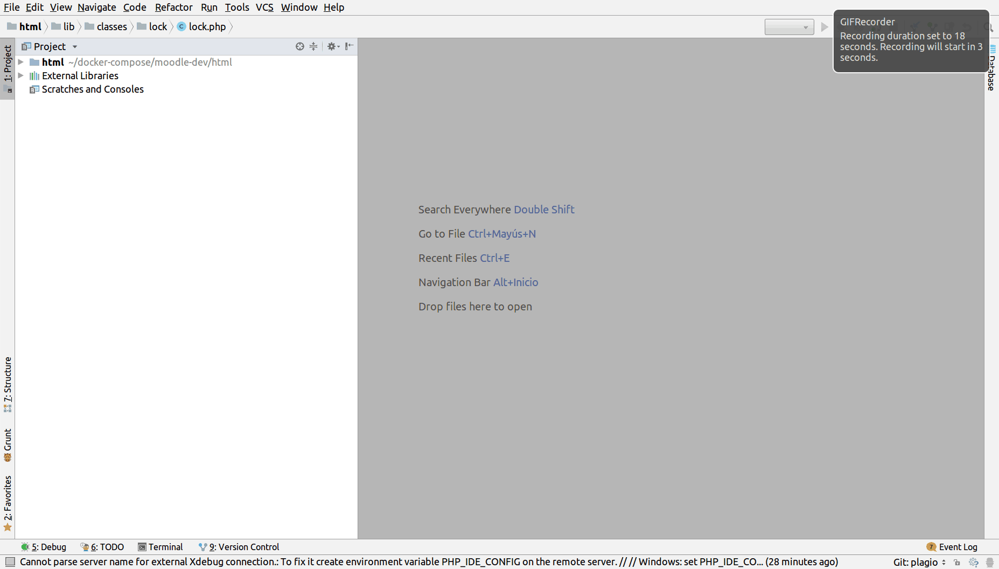

# moodle-php-apache-postregres
Docker para instalar Moodle

## IMPORTANTE: Este repositorio es una adaptación de varias fuentes, se adapto para lograr la aplicación en producción de un proyecto de Moodle.

Este es un repositorio para crear un entorno de trabajo Moodle.

Componentes:

Apache2
PHP-FPM con XDEBUG 
Postgres

El entorno de trabajo se crea y gestiona con Docker Compose.

## Consideraciones preliminares:

1. Tener Docker. Ver  [Docker](https://docs.docker.com/install/)
2. Tener Docker Compose. Ver  [Docker Compose](https://docs.docker.com/compose/install/)
3. Descargar este repositorio y acceder a él: ```git clone https://github.com/guillez/moodle-php-apache-postregres.git && cd moodle-php-apache-postregres```
4. Copiar en la carpeta html el repositorio de Moodle: ```git clone --branch MOODLE_35_STABLE --depth 1 git://github.com/moodle/moodle html```
5. Desplegar con: ```docker-compose -p mi_proyecto up -d```

## Configuración de Variables

La siguiente tabla contiene las variables utilizadas en el archivo [**.env**](.env) para Docker Compose. Los valores por defecto funcionan para una configuración inicial. Cámbielos de ser necesario.

| Variable | Valor por defecto | Utilidad |
| :--- |:--- |:--- |
| **REPO_FOLDER** | html | Ruta relativa para el código de Moodle |
| **DOCUMENT_ROOT** | /var/www/html | Punto de montaje para **REPO_FOLDER** dentro de contenedores |
| **MY_TZ** | America/Argentina/Buenos_Aires | Zona horaria para los contenedores |
| **PG_LOCALE** | es_ES | Configuración de lugar |
| **PG_PORT** | 5432 | Puerto de base de datos postgres a publicar  |
| **POSTGRES_DB** | moodle | Nombre de la base de datos postgres de Moodle |
| **POSTGRES_USER** | user | Nombre de usuario de la base de datos postgres de Moodle |
| **POSTGRES_PASSWORD** | password | Contraseña de la base de datos postgres de Moodle |
| **PHP_SOCKET** | 9000 | Socket para conectar apache2 con php-fpm |
| **ALIAS_DOMAIN** | localhost | Alias del Dominio |
| **WWW_PORT** | 80 | Puerto web a publicar |
| **MOODLE_DATA** | /var/moodledata | Carpeta de datos de Moodle a montar en los contenedores |
| **WWWROOT** | localhost | Para de nombre de host en la url de config.php de Moodle |

## Estructura de Docker Compose
A continuación se incluye una tabla que resume la estructura del archivo de Docker Compose:

| Componente | Tipo | Responsabilidad | Contenido | Configuración |
| :--- |:--- | :--- | :---| :---|
| **apache2** | Contenedor | Servidor web | Debian9, Apache2 | El mínimo de módulos de [Apache2](http://dockerfile.readthedocs.io/en/latest/content/DockerImages/dockerfiles/php-apache.html#web-environment-variables) |
| **cron** | Contenedor|Tarea de cron de Moodle | Debian9, Cron | Frecuencia de ejecución de tarea [cron de Moodle](https://docs.moodle.org/35/es/Cron) |
| **php-fpm** | Contenedor | Interprete y manejador de procesos para PHP | Debian9, PHP-FPM, XDEBUG | Modulos de php y paquetes adicionales para Moodle  |
| **postgres** | Contenedor | Gestor de base de datos  | Debian9, Postgres | [Usuario y base de datos](https://hub.docker.com/_/postgres/) |
| **db_dumps** | Volumen | Restaurar una base de datos inicial | Archivos de respaldo de base de datos. | Para restaurar al iniciar, nombre el archivo sql de respaldo como dump-init.sql.gz |
| **moodledata** | Volumen | Almacén de datos de Moodle | Archivos generados por Moodle | [Moodle data dir ](https://docs.moodle.org/all/es/Gu%C3%ADa_r%C3%A1pida_de_Instalaci%C3%B3n#Crea_el_directorio_de_datos) |
| ***REPO_FOLDER*** | Volumen | Código de aplicación  | Código de Moodle  | Por defecto es './html' (ver archivo .env) |

## Gestión del proyecto con Docker Compose
> **Dentro de la carpeta del proyecto**

1. Correr proyecto
docker-compose -p mi-proy up -d

2. Detener el proyecto

docker-compose stop
# docker-compose stop php-fpm

3. Iniciar el proyecto

docker-compose start
# docker-compose start php-fpm

4. Eliminar proyecto

docker-compose down
# Eliminar los volumenes también:
# docker-compose --volumes
# Eliminar con un nombre de proyecto especifico:
# docker-compose -p mi-proy down

5. Logs

docker-compose logs
# docker-compose logs -f --tail="20" php-fpm

### XDEBUG
> Se utiliza el idekey `PHPTEST`

#### PHPStorm
Configuración para depurar con IDE PHPStorm:

1. Agregar server:
    * Settings -> Languages -> PHP -> Servers
    * Name: localhost
    * Host: localhost
    * Port: 80
    * Debugger: Xdebug
    * Use path mapping: checked
    * Absolute path on the server: /var/www/html



2. Agregar PHP remote debug
    * Run / Debug Configurations -> PHP remote debug
    * Use server created in step #1 and set idekey `PHPTEST`


3. Activar botón `Start listening for PHP Debug Connections` 

### Depurar tareas de cron
Siga los pasos anteriores, establezca una interrupción y ejecuta en el la línea de comandos:
```bash
docker-compose exec cron php admin/cli/cron.php
```
Se pueden ejecutar también [tareas específicas de cron](https://docs.moodle.org/all/es/Administraci%C3%B3n_por_l%C3%ADnea_de_comando#Trabajos_agendados)Por ejemplo:
```bash
docker-compose exec cron php admin/tool/task/cli/schedule_task.php --execute='\core\task\cache_cleanup_task'
# Listar tareas
# docker-compose exec cron php admin/tool/task/cli/schedule_task.php --list
```

### Este proyecto contempla de modo opcional el uso de Pgadmin4 para los desarrolladores
### Tener en cuenta de habilitar esta opcion comentada en archivo de docker
Pasos para usar pgadmin4
1. Ingresar a http://localhost:5050
2. En ```File -> Preferences -> Binary paths``` establecer en ```/usr/bin```
3. Agregar nuevo servidor:
    * Pestaña ```General```
        * Name: Un nombre para el servidor
    * Pestaña ```Connection```
        * Host name/address: ```postgres```
        * Host Username: ```user```
        * Host Password: ```password```
    * Guardar

## Notas
> Restaurar una base de datos al inicio

Se puede restaurar una base de datos, agregando el script sql generador (comprimido como gzip) a la caperta db_dumps y nombrando el archivo como dump-init.sql.gz
> **IMPORTANTE**: Dependiendo del tamaño, la ejecución de este sql podría demorar la disponibilidad inicial de la base de datos.
